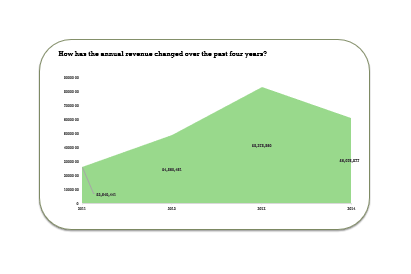

# Excel Project: Customer Behaviour and Revenue Report

## Introduction

This is my first Excel project, created to demonstrate foundational data analysis and visualization skills using Microsoft Excel. The project focuses on transforming raw customer transaction data into actionable insights through cleaning, formulas, pivot tables, and interactive dashboards. By analysing metrics like revenue trends, customer demographics, and purchasing behaviour, this work showcases my ability to:

- Clean and structure datasets for analysis.
- Derive key metrics using Excel functions.
- Visualize trends with pivot charts and slicers for dynamic reporting.

As an introductory project, it highlights my proficiency in Excel’s core tools for business analytics, from basic data wrangling to clearly presenting insights.

## Problem Statement

The raw dataset lacked clear trends, making it difficult to answer critical business questions:

- Which customer segments (age, gender, location) generate the most revenue?
- How do marital status and income levels influence purchasing habits?
- Are there specific periods with higher sales activity?

This project addresses these gaps through data cleaning, transformation, and visualization.

## Skills Demonstrated
### Data Preparation
- **Cleaning**: Standardized values ("F" → "Female", "M" → "Male"), handled missing data.
- **Transformation**: Created calculated columns (DATEDIF for age, IFS for segmentation).
- **Automation**: Converted data to Excel Tables for dynamic updates.

### Formulas & Functions
- **Text**: CONCATENATE (customer names), TEXT (month/weekday formatting).
- **Logical**: IFS (age bands, customer value tiers).
- **Date/Time**: YEAR, DATEDIF (age calculation).
  
### Analysis & Visualization
- **Pivot Tables**: Summarized revenue by age, country, gender, and period.
- **Charts**: Created bar, line and pie charts to showcase findings.
- **Interactivity**: Added slicers for country, age band, marital status and a timeline to filter by date.

### Reporting
- Designed a dashboard-like layout for intuitive data exploration.

## Data Sourcing
The dataset was sourced from **Kaggle**, a public platform for open datasets.

It contains customer transaction records with attributes including CustomerID, Gender, MaritalStatus, YearlyIncome, Revenue, OrderDate, BirthDate, and Country. 

 ## Data Cleaning & Transformation
 
1. **Standardized Values:**
- Replaced "M"/"F" in the Gender column with "Male"/"Female" using **Find & Replace**.
- Converted OrderDate into separate Year, Month, and Weekday columns using:
  - YEAR() for year extraction.
  - TEXT() for month/weekday names (e.g., "January", "Monday").

2.	**Derived Columns:**
- **Customer Age**: Calculated customer age with the DATEDIF function(BirthDate, OrderDate, "Y").
- **Age Band**: Categorized into groups (e.g, "18–25") using the nested IFS function.
- **Customer Value**: Segmented into tiers based on their yearly income thresholds via the IFS function.
- **Customer Name**: Combined Firstname and Lastname with the CONCATENATE function.
  
3.	**Structural Improvements:**
- Converted the dataset into an Excel Table to auto-update formulas/pivot tables with new data.

## Data Visualization
1. **Pivot Tables & Charts:**
- **Revenue by Age Band**: Bar chart showing revenue concentration in age groups.
- **Revenue by Country**: Bar chart comparing sales across geographic regions.
- **Revenue by Gender**: Pie chart displaying gender-based spending.
- **Revenue by Year**: Line chart highlighting seasonal trends.
- **Revenue by Customer Segment**: Pie chart displaying spending for the different tiers.

  
Pivot Tables          |    Pivot Charts
:--------------------:|:------------------:
  |   

2. **Interactive Dashboard:**
- **Slicers**: Country, Age Band, Marital Status for dynamic filtering.
- **Timeline**: OrderDate to analyze trends by month, quarter, year and days.

## Findings

### Which gender demographic demonstrates more revenue?

The analysis reveals a slight revenue disparity between genders, with male customers contributing 53.93% of total revenue compared to 46.07% from female customers. While the difference is relatively balanced, further investigation could explore whether this gap correlates with factors like product preferences, average order value or income levels. 

### How has the annual revenue changed over the past four years?

Revenue grew steadily from 2011 to 2013, peaking in 2013, contributing to 38% of total revenue, before declining in 2014.
Investigate potential causes for the 2014 sales decline, including market shifts or operational changes.

### Which countries generate the most revenue?

The revenue distribution reveals significant geographic disparities, with Australia dominating as the top-performing market, contributing 32.6% of total revenue, followed by the United Kingdom with 13.2% and Germany with 11.4% of the total revenue.
The Northwest (US) and France delivered moderate revenue contributions, while Canada significantly underperformed in comparison.

### Which age group contributes the most to the overall revenue?

The Adults age group generated the highest revenue contributing to 47% of the total revenue, followed closely by Seniors contributing 35% of the total revenue.
The Elderly customers contributed to 13% of the total revenue, and Young Adults accounted for just 4%, indicating a significant revenue gap between mature and younger demographics.

### How do the different customer segments contribute to the overall revenue?

Convinced Seekers dominated revenue generation, contributing $15.1 million (69.5% of total) - indicating this segment is your most valuable customer group. Brand Seekers accounted for $3.8 million (17.3%), while Casual Buyers generated $2.9 million (13.2%), showing significantly lower purchasing impact.

## Recommendation

1. Address Declining Sales Post-2013 Peak: Investigate the 27% revenue drop in 2014. Was it due to economic factors, inventory issues, or competitor activity? Replicate strategies from high-growth years (2011–2013), such as seasonal discounts or product launches.

2. Leverage Gender-Based Insights: While male customers slightly outperform females, explore whether this reflects product assortment or marketing bias. Test campaigns targeting high-value female demographics to balance revenue streams.

3. Optimize Geographic Performance: Allocate more resources to top markets (Australia, UK, Germany) while analyzing why Canada and Central/Southeast U.S. lag behind. Run region-specific promotions in moderate-growth areas (e.g., France, Northwest U.S.) to boost market share.

4. Expand Engagement with Older Demographics: Since Adults and Seniors contribute 82% of revenue, tailor product offerings and messaging to their preferences. Investigate why Young Adults underperform, test youth-oriented campaigns or payment flexibility.

5. Target High-Value Customer Segments: Focus marketing efforts on Convinced Seekers with loyalty programs or exclusive offers to further boost retention. Develop strategies to convert Brand Seekers and Casual Buyers into repeat purchasers (e.g., personalized recommendations, post-purchase follow-ups).

## Conclusion

This analysis shows that most of the revenue comes from older customers (Adults), loyal "Convinced Seekers", and markets like Australia and the UK. To grow sales, one should:

1. Keep these high-value groups happy with targeted offers.
2. Find ways to attract younger buyers and weaker markets.
3. Fix the drop in sales after 2013 by learning from past success.

By focusing on these key areas, one can boost profits and make smarter business decisions.

